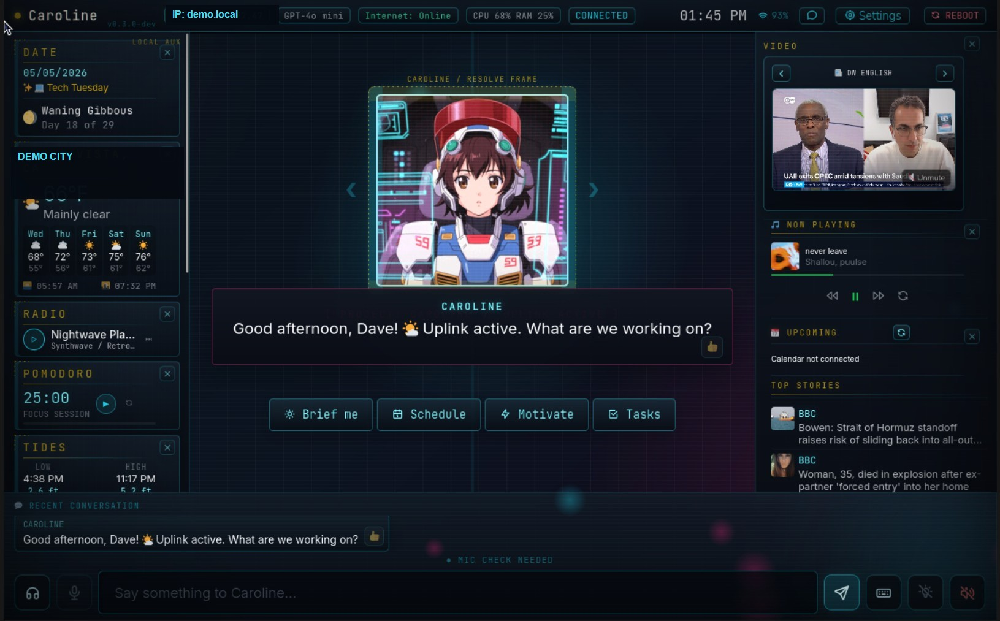
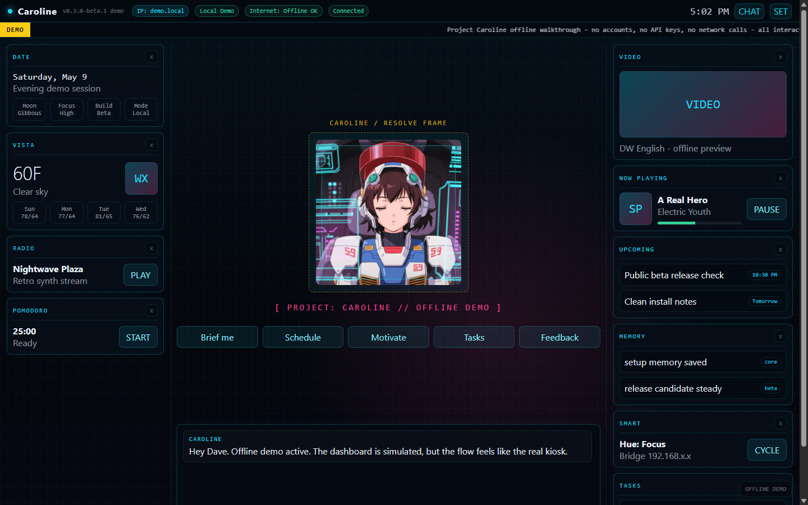

# Project: Caroline

Your local AI sidekick for your desk, kiosk, or smart home: a cyberpunk assistant console with persistent chat, widgets, tasks, music, lights, reminders, and more.

Caroline runs on your own Raspberry Pi or Ubuntu box. Cloud is optional: use a private local model through Ollama, or connect OpenRouter for faster access to stronger hosted models.




## Core Modules

- AI chat with memory using local Ollama or cloud models through OpenRouter
- Google Calendar event add, read, and delete support
- Local task management
- Philips Hue smart lighting control
- Spotify playback controls
- Weather, news, video, tides, radio, Pomodoro, memory, and system widgets
- Fullscreen kiosk mode or server/client mode from another browser

## Calling Artists And Animators

The current Caroline avatars are AI generated, but the long-term goal is original character art and expressive animations. Character artists, animators, 2D/3D designers, and creative collaborators are welcome.

Interested in helping shape Caroline's visual identity? Start a conversation in [GitHub Discussions](https://github.com/Project-Caroline/project-caroline/discussions).

## Install

Recommended public beta build:

```bash
curl -fsSL https://raw.githubusercontent.com/Project-Caroline/project-caroline/release/install.sh | bash
```

Nightly/dev build:

```bash
curl -fsSL https://raw.githubusercontent.com/Project-Caroline/project-caroline/nightly/install.sh | bash -s -- --nightly
```

Exact frozen beta tag:

```bash
curl -fsSL https://raw.githubusercontent.com/Project-Caroline/project-caroline/v0.3.0-beta.2/install.sh | bash -s -- --channel v0.3.0-beta.2
```

Caroline installs Node.js, Node-RED, nginx, the web UI, optional local AI, and the system service.

For microphone input from another browser, use Chrome or Chromium with the secure voice URL printed by the installer:

```text
https://YOUR-CAROLINE-IP:8444/
```

On a Raspberry Pi kiosk, the installer prefers Chromium because Firefox does not support Caroline's browser wake-word input.

The normal `http://YOUR-CAROLINE-IP:8080/` URL still works for typing/chat.
The installer can optionally protect the web UI and proxied local admin APIs with a local browser login. If enabled, username is `caroline`; on the Caroline host, read the generated password with `cat ~/caroline/caroline_admin_password.txt`.

## Pick Your Setup

| Platform | Status | Best For |
|---|---|---|
| Raspberry Pi OS Desktop 64-bit | Primary beta | Dedicated kiosk screen |
| Ubuntu Server 64-bit | Supported | Server/client mode from another browser |
| Ubuntu Desktop 64-bit | Works, less tested | Desktop testing or local browser use |
| WSL Ubuntu | Dev/test only | Windows-side browser testing |

## Beta Kits

DIY install is the main path for now. I am also considering a small run of ready-to-go Project Caroline Raspberry Pi kits for people who want a turnkey setup. If that would be useful to you, reach out so I can gauge demand.

## Beginner Guides

- [Start here: choose the right install guide](docs/how-to.md)
- [Promo screenshots and short copy](docs/promo.md)
- [How to create a VM, USB installer, or Raspberry Pi SD card](docs/how-to-create-install-media.md)
- [How to install on Raspberry Pi OS](docs/how-to-raspberry-pi-os.md)
- [How to install on Ubuntu Server](docs/how-to-ubuntu-server.md)
- [How to install on Ubuntu Desktop](docs/how-to-ubuntu-desktop.md)
- [How to set up SSH and a stable IP](docs/network-prep.md)
- [How to set up Google Calendar OAuth](docs/google-oauth.md)
- [Clean uninstall/reinstall QA checklist](docs/clean-reinstall-qa.md)

## Requirements

- 64-bit Raspberry Pi OS or Ubuntu
- 4GB RAM minimum; 6-8GB is better for local AI
- Internet during install
- A stable local IP address is strongly recommended
- Do not expose Caroline directly to the public internet

## What Caroline Can Do

- Chat with local Ollama or cloud models through OpenRouter
- Add, read, and delete Google Calendar events
- Manage local tasks
- Control Philips Hue lights
- Show weather, news, video, tides, radio, Pomodoro, memory, and system widgets
- Run as a fullscreen kiosk or as a server opened from another browser

## Optional Integrations

Add these later in **Settings**:

- OpenRouter API key for fast cloud AI
- Google Calendar OAuth
- Spotify client ID
- Philips Hue bridge/key
- Discord bot token and channel ID
- NOAA tide station

## Update

Use **Settings > About > Update**, or rerun:

```bash
curl -fsSL https://raw.githubusercontent.com/Project-Caroline/project-caroline/release/install.sh | bash
```

Settings, API keys, tasks, and memory are preserved.

## Release Channels

- **Release:** the `release` branch is the recommended public beta channel.
- **Nightly/dev:** the `nightly` branch gets the newest tested work first.
- **Frozen tags:** tags such as `v0.3.0-beta.2` are exact snapshots.

For release notes, tagging, and Ubuntu/Pi QA steps, see [Release process](docs/release.md) and [v0.3.0-beta.2 notes](docs/releases/v0.3.0-beta.2.md).

## Uninstall

```bash
curl -fsSL https://raw.githubusercontent.com/Project-Caroline/project-caroline/release/uninstall.sh | sudo bash
```

## Safety

Caroline is designed for your local network. Keep ports `8080`, `8443`, `8444`, and SSH private unless you are using a VPN such as Tailscale or WireGuard. Node-RED runs as a localhost-only backend behind Caroline's web server.

## Try The Demo

The simulated dashboard is available here:

[Launch the Project Caroline offline demo](https://project-caroline.github.io/project-caroline/)

This is a static, no-account walkthrough from [demo/index.html](demo/index.html). It uses bundled assets and canned responses, so it is safe to share, but the real installed kiosk is the primary experience.



## Support

Caroline is free to use. If you enjoy it and want to support future builds:

https://buymeacoffee.com/daveeuson
