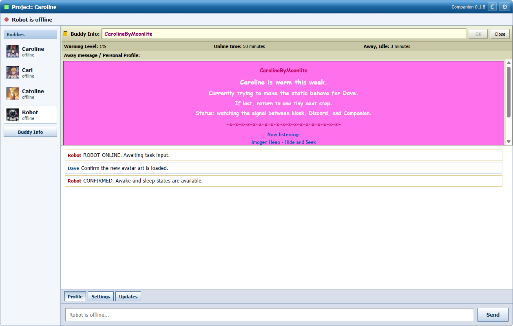

# Project: Caroline

Project: Caroline is a local AI host and kiosk for your desk, wall screen, Raspberry Pi, Ubuntu box, or experimental Steam Deck setup.

It gives you a persistent assistant console with chat memory, calendar actions, local tasks, smart-home controls, music, weather, news, video, system status, and ambient widgets. It is built for your local network first: install Caroline on one host, then open it from the kiosk screen, a phone or tablet browser, a full desktop browser, or the optional desktop companion app.

Caroline is not just a chatbot page. It is a small personal command center meant to stay open all day.




## Host, Kiosk, Phone, Browser, Companion

Caroline has one **host** and as many **clients** as you want on your local network.

- The host is the device running Caroline: a Raspberry Pi, Ubuntu server/desktop, or experimental Steam Deck install.
- The kiosk is the host's own fullscreen browser view, ideal for a wall screen or desk display.
- A phone or tablet can open `http://YOUR-CAROLINE-IP:8080/` as a mobile-friendly touch view for quick chat, avatar presence, status, settings, and light remote control without the full widget wall.
- Any browser on your network can open `http://YOUR-CAROLINE-IP:8080/` for the same dashboard and chat.
- Chrome or Chromium can use the secure voice URL `https://YOUR-CAROLINE-IP:8444/` for microphone and wake-word access.
- The Companion app is a retro messenger-style desktop client that can pair with multiple Caroline hosts, switch between buddies, keep local chat history, and clear saved chats for privacy.

That means Caroline can be a visible room kiosk, a headless home server, a phone remote, and a desktop chat buddy at the same time.

## How A Day Looks

1. Caroline runs on a Raspberry Pi, Ubuntu box, or Steam Deck somewhere on your home network.
2. The kiosk screen stays open in the room for glanceable weather, calendar, tasks, music, memory, and system widgets.
3. Your phone opens the same Caroline address when you want a quick chat, status check, or setting change without walking over to the kiosk.
4. Your desktop Companion app sits off to the side like a retro buddy list, so Caroline, Carl, Catoline, and other hosts can each feel like their own chat presence.
5. Everything stays LAN-first: the host does the work, and each client is just another way to talk to it.

## What Caroline Can Do

- AI chat with memory using local Ollama or cloud models through OpenRouter
- Google Calendar event add, read, and delete support
- Local task management
- Philips Hue smart lighting control
- Spotify playback controls
- Weather, news, video, tides, radio, Pomodoro, memory, and system widgets
- Fullscreen kiosk mode or server/client mode from another browser
- Mobile-friendly phone/tablet browser view for quick LAN chat and controls
- Desktop Companion app for Caroline, Carl, Catoline, Robot, and future host personalities
- Multiple paired hosts with per-buddy transcripts, unread message badges, and local chat-history deletion

## Quick Install

Recommended public beta build:

```bash
sudo apt-get update && sudo apt-get install -y bash curl ca-certificates
curl -fsSL https://raw.githubusercontent.com/Project-Caroline/project-caroline/release/install.sh | tr -d '\r' | bash -s --
```

Nightly/dev build:

```bash
curl -fsSL https://raw.githubusercontent.com/Project-Caroline/project-caroline/nightly/install.sh | tr -d '\r' | bash -s -- --nightly
```

Exact frozen beta tag:

```bash
curl -fsSL https://raw.githubusercontent.com/Project-Caroline/project-caroline/v0.3.0-beta.4/install.sh | tr -d '\r' | bash -s -- --channel v0.3.0-beta.4
```

Caroline installs Node.js, Node-RED, nginx, the web UI, optional local AI, and the system service.

The optional desktop companion app is released separately:

[Download Project: Caroline Companion](https://github.com/Project-Caroline/project-caroline/releases/tag/companion-v0.1.12)

Use the platform-named installer for your computer:

| Platform | Release asset |
|---|---|
| Windows | `Windows_Project.Caroline.Companion_0.1.12_x64_en-US.msi` |
| Ubuntu / Pop!_OS | `Linux_Project.Caroline.Companion_0.1.12_amd64.deb` |
| Steam Deck Desktop Mode | `Linux_Project.Caroline.Companion_0.1.12_amd64.AppImage` |
| Mac Apple Silicon | `MacAppleSilicon_Project.Caroline.Companion_0.1.12_aarch64.dmg` |
| Mac Intel | `MacIntel_Project.Caroline.Companion_0.1.12_x64.dmg` |

The companion pairs with the `SYNC:` code shown on each Caroline host and talks to:

```text
ws://YOUR-CAROLINE-IP:8080/ws/caroline
```

That `/ws/caroline` path is the fixed service route. The host's configured buddy name and device type are synced separately, so a Steam Deck can show up as Carl on Steam while using the same route.

If you run more than one Caroline host, the buddy list can switch between them like a classic instant messenger.

For microphone input from another browser, use Chrome or Chromium with the secure voice URL printed by the installer:

```text
https://YOUR-CAROLINE-IP:8444/
```

On a Raspberry Pi kiosk, the installer prefers Chromium because Firefox does not support Caroline's browser wake-word input.

The normal `http://YOUR-CAROLINE-IP:8080/` URL still works for typing/chat. On phones and tablets, the mobile layout focuses on the avatar, chat, connection status, settings, and compact controls instead of trying to squeeze every kiosk widget onto a small screen.
The installer can optionally protect the web UI and proxied local admin APIs with a local browser login. If enabled, username is `caroline`; on the Caroline host, read the generated password with `cat ~/caroline/caroline_admin_password.txt`.

## Choose Your Setup

| Platform | Status | Best For |
|---|---|---|
| Raspberry Pi OS Desktop 64-bit | Validated primary beta | Dedicated kiosk screen |
| Ubuntu Server 64-bit | Supported | Server/client mode from another browser |
| Ubuntu Desktop 64-bit | Validated | Server/client mode from another browser; local kiosk mode is less tested |
| Steam Deck / SteamOS | Smoke-validated nightly | Repurposed handheld desk terminal |
| Bazzite 44 / NVIDIA laptop | Smoke-validated beta | GPU-backed local AI host in server/client mode |
| Phone / tablet browser | Mobile client view | Quick chat, status, settings, and remote controls on your LAN |
| WSL Ubuntu | Dev/test only | Windows-side browser testing |

## Current Beta Reality

- Raspberry Pi OS Desktop and Ubuntu are the main public beta paths.
- Raspberry Pi OS Desktop kiosk mode is smoke-validated with the automatic Pi performance profile, OpenRouter as the preferred AI path, and lazy-loaded visual media.
- Steam Deck / SteamOS support tracks nightly and is smoke-validated in server/client mode by stable IP; mDNS hostnames can be slower from Windows networks.
- Bazzite 44 with NVIDIA RTX 2070 Max-Q is smoke-validated as a LAN host with local Ollama. `mistral:7b` is the recommended default; `qwen3:1.7b` is the fast fallback.
- Phone and tablet browsers are lightweight Caroline clients, not separate installs; they work best on the same trusted LAN as the host.
- OpenRouter is the best AI experience for speed and answer quality.
- Ollama is private and local, but small hardware can be slower and less polished.
- Ubuntu Desktop server/client mode is validated on a 50GB VM with CPU-only Ollama using `qwen2.5:1.5b`.
- Caroline is designed for trusted local networks. Do not expose it directly to the public internet.

## Beginner Guides

- [Start here: choose the right install guide](docs/how-to.md)
- [Promo screenshots and short copy](docs/promo.md)
- [Beta outreach kit and post drafts](docs/beta-outreach-kit.md)
- [How to create a VM, USB installer, or Raspberry Pi SD card](docs/how-to-create-install-media.md)
- [How to install on Raspberry Pi OS](docs/how-to-raspberry-pi-os.md)
- [How to install on Ubuntu Server](docs/how-to-ubuntu-server.md)
- [How to install on Ubuntu Desktop](docs/how-to-ubuntu-desktop.md)
- [Experimental Steam Deck / SteamOS install](docs/how-to-steamos.md)
- [How to install the Companion app](docs/companion-client.md)
- [How to set up SSH and a stable IP](docs/network-prep.md)
- [How to set up Google Calendar OAuth](docs/google-oauth.md)
- [How to set up Discord](docs/discord.md)
- [How to beta test Project: Caroline](docs/beta-testing.md)
- [Public beta health snapshot](docs/beta-health.md)
- [Clean uninstall/reinstall QA checklist](docs/clean-reinstall-qa.md)
- [Architecture overview](docs/architecture.md)
- [Backup and restore](docs/backup-restore.md)
- [Release notes](docs/releases/README.md)

## AI Options

The installer detects your hardware, RAM, and platform, then preselects the local model it thinks fits best. You can still override the choice during setup.

- Best experience: **OpenRouter**
- Raspberry Pi / Ubuntu local quality: **qwen2.5:1.5b**
- Steam Deck local quality: **qwen3:1.7b**
- Bazzite / RTX 2070 local quality: **mistral:7b**
- RTX 4070-class desktop local quality: **gemma4:e4b**
- Fast general local fallback: **qwen2.5:1.5b**
- Safe/legacy fallback: **gemma3:1b**
- Ubuntu Desktop VM validation: **50GB disk**, CPU-only Ollama, **qwen2.5:1.5b**

For platform-specific rankings from the latest direct Ollama benchmarks, see [Local AI model recommendations](docs/local-ai-models.md).

## Requirements

- 64-bit Raspberry Pi OS or Ubuntu; SteamOS is experimental on nightly
- 4GB RAM minimum; 6-8GB is better for local AI
- 50GB disk recommended for Ubuntu VM local Ollama testing; 12GB images are too small for the recommended model after OS and runtime packages
- Internet during install
- A stable local IP address is strongly recommended
- Do not expose Caroline directly to the public internet

## Optional Integrations

Add these later in **Settings**:

- OpenRouter API key for the best AI experience
- Google Calendar OAuth
- Spotify client ID
- Philips Hue bridge/key
- Discord bot token and channel or DM destination
- NOAA tide station

## Update

Use **Settings > About > Update**, or rerun:

```bash
sudo apt-get update && sudo apt-get install -y bash curl ca-certificates
curl -fsSL https://raw.githubusercontent.com/Project-Caroline/project-caroline/release/install.sh | tr -d '\r' | bash -s --
```

Settings, API keys, tasks, and memory are preserved.

## Release Channels

- **Release:** the `release` branch is the recommended public beta channel.
- **Nightly/dev:** the `nightly` branch gets the newest tested work first.
- **Frozen tags:** tags such as `v0.3.0-beta.4` are exact snapshots.

For release notes, tagging, and Ubuntu/Pi QA steps, see [Release process](docs/release.md) and [v0.3.0-beta.4 notes](docs/releases/v0.3.0-beta.4.md).

## Uninstall

```bash
curl -fsSL https://raw.githubusercontent.com/Project-Caroline/project-caroline/release/uninstall.sh | tr -d '\r' | sudo bash -s --
```

## Safety

Caroline is designed for your local network. Keep ports `8080`, `8443`, `8444`, and SSH private unless you are using a VPN such as Tailscale or WireGuard. Node-RED runs as a localhost-only backend behind Caroline's web server.

Caroline stores settings, API tokens, OAuth data, task state, and chat memory on the device where it is installed. Optional telemetry prompts are opt-in and are intended for anonymous project-health counts and troubleshooting signals, not chat content or personal data.

## Try The Demo

The simulated dashboard is available here:

[Launch the Project: Caroline offline demo](https://project-caroline.github.io/project-caroline/)

This is a static, no-account walkthrough from [demo/index.html](demo/index.html). It uses bundled assets and canned responses, so it is safe to share, but the real installed kiosk is the primary experience.


## Calling Artists And Animators

The current Caroline avatars are AI generated, but the long-term goal is original character art and expressive animations. Character artists, animators, 2D/3D designers, and creative collaborators are welcome.

Interested in helping shape Caroline's visual identity? Start a conversation in [GitHub Discussions](https://github.com/Project-Caroline/project-caroline/discussions).

## Beta Kits

DIY install is the main path for now. I am also considering a small run of ready-to-go Project: Caroline Raspberry Pi kits for people who want a turnkey setup. If that would be useful to you, reach out so I can gauge demand.

## Roadmap

See what's planned next: [docs/roadmap.md](docs/roadmap.md)

## Support

Caroline is free to use. If you enjoy it and want to support future builds:

https://buymeacoffee.com/daveeuson

Made by Dave Euson

- Website: https://daveeuson.github.io/
- LinkedIn: https://www.linkedin.com/in/daveeusonpost/
