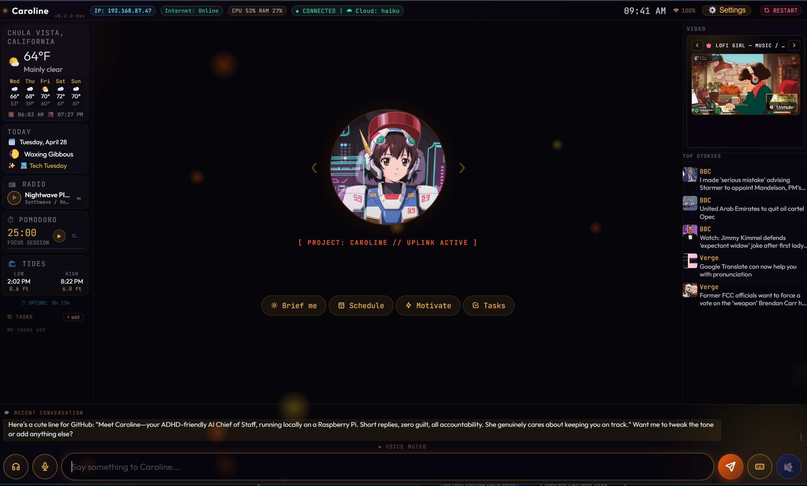

#### UNDER DEVELOPMENT####
Looking to launch Late April


# Project: Caroline

**Your open-source, highly personalized digital sidekick.**

> "Not a voice assistant you talk at. A co-pilot that's actually on your side."

---



## The Story

Project: Caroline is your portal to an ambient digital sidekick completely personalized to you. When they wake up, a brief setup wizard establishes their baseline personality. From there, you can dive into the settings to fully customize their core system prompt — creating a smart dashboard that truly understands how you work, think, and communicate.

---

## Privacy First

One of the core values of this project is that your information is safe. There is no telemetry, no data harvesting, and no corporate oversight. Personal information is not collected.

If you choose to run the AI in **Local** mode (via Ollama), your prompts, calendar events, and tasks never even leave your local network. Your data is yours.

---

## What It Does

- **Cyberpunk UI** — Ambient kiosk interface served on port 8080
- **Robust Backend** — Node-RED on port 1880 as a bare-metal systemd service
- **Persistent Memory** — AI chat with memory across sessions
- **Productivity** — Creates calendar events and manages Google Tasks via chat
- **Proactive AI** — Caroline checks in four times a day with lightweight context
- **Local & Cloud AI** — Ollama (llama3.2, phi3:mini, gemma2:2b) free forever, or OpenRouter (Claude Haiku) for ~$0.05/month
- **Built-in Widgets** — Live news, weather, tides, radio, Pomodoro timer, task lists, and TV channels
- **Smart Home** — Philips Hue control
- **OAuth Integrations** — Google and Spotify connect from the GUI; no JSON key upload required for normal setup

---

## Installation

```bash
curl -sSL https://raw.githubusercontent.com/daveeuson/project-caroline/main/install.sh | bash
```

The installer asks for your name, timezone, location, and whether to install Ollama. **No terminal is needed after install** — everything is configured in the GUI, with API keys entered directly in the kiosk settings panel.

After install, open **Settings** in Caroline:

- **Google:** create an OAuth client, paste the Client ID, then use **Connect Google** for Calendar and Google Tasks. The old service-account JSON upload is kept only as an advanced fallback.
- **Spotify:** add `https://[Pi-IP]:8443/spotify/callback` as the Spotify app redirect URI, open `https://[Pi-IP]:8443` once to accept the self-signed certificate, then use **Connect Spotify**.
- **Hue / Discord / OpenRouter:** paste credentials directly in Settings.

### Requirements

- Raspberry Pi 4 or 5 (4GB+ recommended)
- Raspberry Pi OS Desktop 64-bit *(Ubuntu 22.04+ also supported)*
- Firefox ESR in kiosk mode via the labwc Wayland compositor

---

## Stack

| Layer | Technology |
|---|---|
| Frontend | Single HTML file |
| Backend | Node-RED (bare-metal systemd, no Docker) |
| Web server | nginx (serves HTML on port 8080; HTTPS OAuth proxy on 8443) |
| AI (local) | Ollama on localhost:11434 |
| AI (cloud) | OpenRouter API |
| Display | Firefox ESR, kiosk mode, 1280×800 |

---

## Architecture

```
Browser
  ├── HTTP GET (port 8080) ──────► nginx ──► index.html
  ├── HTTPS OAuth (port 8443) ───► nginx ──► Node-RED callbacks
  └── WebSocket (port 1880) ─────► Node-RED ──► Ollama (local)
                                            └──► OpenRouter (cloud)
```

Node-RED runs as a bare-metal systemd service. nginx serves the static kiosk on port 8080 and provides a local self-signed HTTPS proxy on port 8443 for OAuth providers that require HTTPS callbacks. WebSocket traffic still goes directly to Node-RED on port 1880.

---

## Cost Breakdown

| Service | Est. Monthly Cost | Details |
|---|---|---|
| Ollama | $0.00 | Local AI, free forever |
| OpenRouter + Claude Haiku | ~$0.05 | Cloud-based processing |
| **Target** | **Under $5.00** | A highly economical system |

---

## Deep Personality Customization

While the initial setup gives your sidekick a baseline vibe, you can deeply customize their brain in the Settings panel. If you use another AI regularly (like ChatGPT or Claude), it already knows your exact communication style.

Copy and paste this prompt into your existing AI to generate a highly tailored personality:

> *"I am setting up an open-source, local digital sidekick kiosk called Project: Caroline. Since you already know my workflow, communication style, and personality, I want you to write its core Personality Prompt. Based on what you know about me, write a 1-2 paragraph instruction that dictates this new AI's tone, its role in helping me manage my day (e.g., drill sergeant, sarcastic helper, or collaborative co-pilot), and how verbose it should be. The dynamic must remain strictly platonic — playful banter is fine, but it should act like a reliable assistant or sidekick, never a romantic partner. Keep the output formatting-free (no markdown). Do not include functional commands, just the persona."*

---

## Roadmap

```
v0.1 — Core kiosk: chat, widgets, smart home, Pomodoro.            [██████████]
v0.2 — Agent loop, auto-tasks, installer, CI pipeline.             [██████████]  ← you are here
v0.3 — GitHub remote, public release, widget marketplace.          [░░░░░░░░░░]
v1.0 — Hardware agnostic (Windows, Mac, tablet, cloud).            [░░░░░░░░░░]
v2.0 — Virtual Sidekick mode — moods, adaptive workflow.           [░░░░░░░░░░]
```

---

## What Makes It Unique

No other open-source kiosk project combines conversational AI with persistent memory, local model support, a distinct sidekick personality, proactive ambient messages, and a one-command install. MagicMirror² is the closest comparison, but it's a static dashboard. Project: Caroline is an active participant in your day.

---

## Links & Credits

- **GitHub:** [github.com/daveeuson/project-caroline](https://github.com/daveeuson/project-caroline)
- **License:** MIT
- Built by Dave Euson
