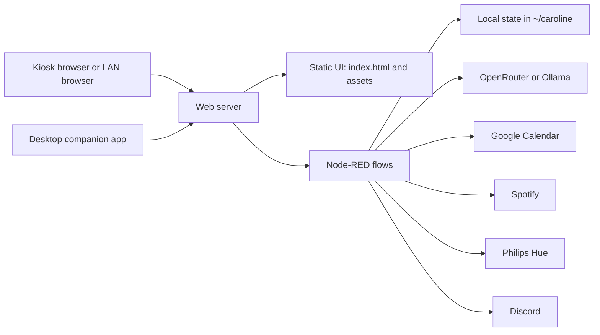

# Architecture Overview

Project: Caroline is a local-first kiosk app. The browser UI is static HTML/CSS/JavaScript, and the local automation layer is Node-RED.

## Main Pieces



## Raspberry Pi And Ubuntu

On Linux installs, Caroline uses nginx as the public web server:

- `http://DEVICE-IP:8080/` serves the kiosk UI.
- `https://DEVICE-IP:8444/` serves the secure browser UI for microphone and wake-word access.
- `https://DEVICE-IP:8443/spotify/` handles the Spotify OAuth redirect path.
- Node-RED runs behind nginx on `127.0.0.1:1880`.
- The system service is `caroline.service`.
- nginx proxies `/chat`, `/health`, `/admin/*`, `/spotify/*`, `/ws/*`, `/system-resources`, `/wifi-signal`, and `/restart` to Node-RED.

The installed app and state live in `~/caroline`. The installer cache lives in `~/project-caroline`.

## Steam Deck / SteamOS

SteamOS is experimental and intentionally avoids system package changes:

- Caroline runs as a user service: `systemctl --user status caroline`.
- Node-RED serves the UI directly on `127.0.0.1:8080`.
- The app is local-only by default.
- Companion access uses an SSH tunnel, for example:

```bash
ssh -L 8088:127.0.0.1:8080 deck@STEAM_DECK_IP
```

Then the companion connects to:

```text
ws://127.0.0.1:8088/ws/caroline
```

## Data Flow

1. The browser or companion sends chat to `/chat` or `/ws/caroline`.
2. Node-RED builds the system prompt from settings, mood, memory, task state, and the selected avatar personality.
3. The AI provider is selected from settings:
   - OpenRouter for cloud models.
   - Ollama for local models.
4. Node-RED parses the reply and routes supported actions:
   - Calendar add/read/delete
   - Local tasks
   - Memory save/delete
   - Hue light control
   - Spotify and Discord helpers
5. Node-RED broadcasts display updates back to the kiosk and companion clients.

## Important Local Files

| Path | Purpose |
|---|---|
| `~/caroline/index.html` | Main kiosk UI |
| `~/caroline/assets/` | Avatar and UI assets |
| `~/caroline/flows.json` | Main Node-RED flow |
| `~/caroline/settings.js` | Node-RED runtime settings |
| `~/caroline/caroline_settings.json` | User settings and integration configuration |
| `~/caroline/caroline_build.json` | Installed version, channel, commit, and host metadata |
| `~/caroline/caroline_channel` | Update channel used by the in-app updater |
| `~/caroline/caroline_tasks.json` | Local task list |
| `~/caroline/caroline_history.json` | Chat history |
| `~/caroline/caroline_context.json` | Saved memory shards |
| `~/caroline/google_oauth.json` | Google OAuth token data |
| `~/caroline/spotify_auth.json` | Spotify OAuth token data |

## Update Flow

The Settings update button writes the requested channel to `~/caroline/caroline_channel`, then launches the local update helper.

- Linux/Pi helper: `/usr/local/sbin/caroline-update`
- SteamOS helper: `~/.local/bin/caroline-update`

The helper checks GitHub, downloads the matching installer from the selected channel or tag, runs it noninteractively, writes `/tmp/caroline-update.log`, and restarts Caroline.

## Trust Boundary

Caroline is designed for trusted local networks. Do not expose ports `8080`, `8443`, `8444`, Node-RED, or SSH directly to the public internet. Use a VPN such as Tailscale or WireGuard if you need remote access.
