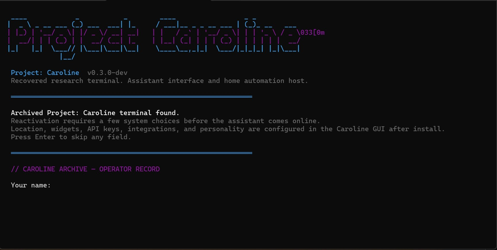
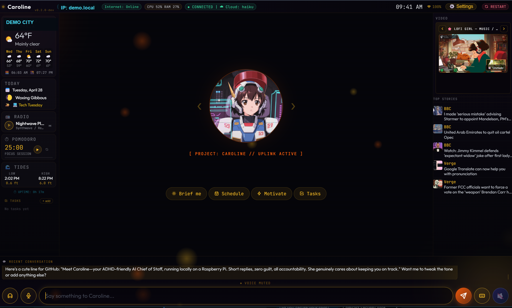

# Project: Caroline Promo Assets

Use these when you need README art, social posts, kit previews, or release notes.

## Screenshots

## Offline Demo

Open [demo/index.html](../demo/index.html) directly in a browser for a no-network clickable walkthrough. It uses bundled local assets and simulated responses, so it is safe to share for quick first impressions.

## Short Copy

Project: Caroline is a local-first AI sidekick kiosk for home dashboards, calendar help, reminders, music, lights, and everyday automation.

Built for Raspberry Pi and Ubuntu, Caroline runs as a fullscreen cyberpunk dashboard or as a small home server you open from another browser.

## v0.3.0-beta.4 Release Blurb

Project: Caroline v0.3.0-beta.4 is the public beta platform-validation build: a local-first AI kiosk for Raspberry Pi OS, Ubuntu, and experimental Steam Deck setups, with chat, memory, Google Calendar, local tasks, Spotify, Philips Hue, Discord relay, weather, news, video, and ambient dashboard widgets. It adds clearer Pi/Ubuntu/SteamOS install guidance, stronger companion pairing and multi-host buddy support, first-run personality questions, safer widget guardrails, and a validated `0.1.11` desktop Companion app.

## One-Liners

- A personal AI kiosk for the little control room in your home.
- Calendar, tasks, weather, music, lights, and chat in one local dashboard.
- A Raspberry Pi assistant console with cyberpunk sidekick energy.
